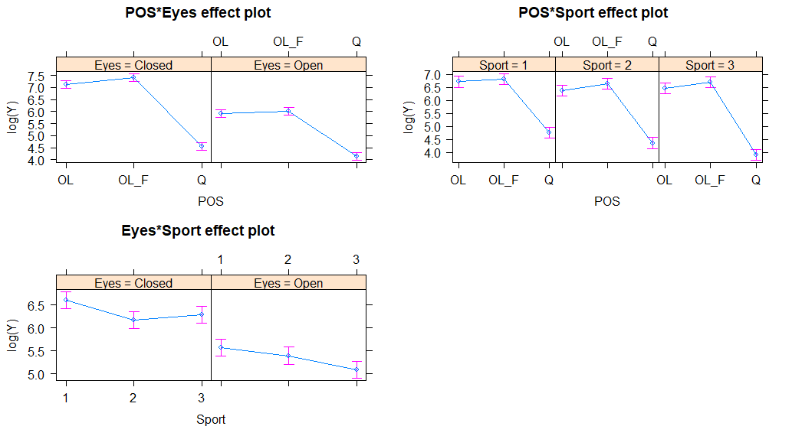

```{r setup, include=FALSE}
knitr::opts_chunk$set(echo = TRUE)
library(readr);library(ggplot2);library(dplyr)
library(magrittr);library(tibble);library(pander)

library(tidyr); library(knitr)
library(tibble);library(corrplot);library(readxl)
library(beanplot);library(lme4);library(lmerTest)
library(emmeans);library(car);library(ggpubr);library(effects)
# Requires the relevant packages
## Reads in the data
bal <- read_excel('Data/LiangData.xlsx', sheet = "Liang_etal")
head(bal)

#nice to see these guys are real data gurus. What an awful format

#goal: modify the data for AOS to be prepped for analysis
bal_area <- bal[,1:8] #pulls the first 8 columns before column 9 (the empty one)
column_names <- bal_area[1,]
bal_tibble <- as_tibble(bal_area[-1,]);names(bal_tibble) <- as.character(column_names)
dim(bal_tibble)
bal_tibble$Participant <- 1:30
#the above code outputs a dataset with 30 rows and 8 measurements

#still a weird format - we would prefer to have 3 columns: Sport, Eyes, Position
eyenames <- grep('C',column_names) #want C because O would be conflated with OL
#recall that we don't have a column for open toes here so only 7 columns instead of 8
bal_tibble_open <- select(bal_tibble, -eyenames)
bal_tibble_closed <- select(bal_tibble, c(eyenames,Sport,Participant))

#adds a feature to the datset for eyes open or closed
bal_tibble_open$Eyes <- rep("Open", nrow(bal_tibble_open))
bal_tibble_closed$Eyes <- rep("Closed", nrow(bal_tibble_closed))


#these will be our position variables to append to the 'long'-form dataset
open_position <- rep(c('Q','OL','OL_F','T'), each = nrow(bal_tibble_open))
closed_position <- rep(c('Q','OL','OL_F'), each = nrow(bal_tibble_closed))

#now we want to actually do the converstion on bal_tibbles to long form
library(tidyr)
open_long <- bal_tibble_open %>% gather(key = Position, value = Y,OQ,OOL, OOL_F,OT)
closed_long <- bal_tibble_closed %>% gather(key = Position, value = Y, CQ,COL,COL_F)
open_long$POS <- open_position
closed_long$POS <- closed_position

#Whew! Now we put it all together by rbinding the two tibbles
full_dat <- rbind(open_long, closed_long)
full_dat$Y <- as.numeric(as.character(full_dat$Y))

fdat <- full_dat %>% filter(!POS %in% 'T') 
filter_dat <- fdat %>% select(-Y) %>% lapply(as.factor)%>% as_tibble()
filter_dat$Y <- fdat$Y
```
\begin{centering}
 \underline{\textbf{Abstract}}
 
 
\textbf{The analysis of Liang et al. (2019) pertaining to the effect of sport expertise on postural stability was revisited using more sophisticated statistical techniques. Subjects' area of a stabilogram was compared for combinations of sport expertise, standing pose, and whether or not their eyes were open. Data were assessed using a mixed-effects model with random intercept for participants. Results indicate that treatment factors interact at two-way levels, but indicate a lack of evidence of a three-way interaction.}
\end{centering}

# Introduction

Postural stability refers to the ability of a respondent to stand up straight with good balance. It is well-established in the literature that posture is controlled via three pieces of information: visual, proprioception, and vestibular information.  Athletes who participate in sports typically develop increased balance ability relative to those who do not; however, much of the research in this field has focused specifically on contact-based sports such as football and rugby. Given this, Liang et al. (2019) designed an experiment to compare postural stability for contact sport athletes based vs those who played non-contact sports.  For the purposes of this research, contact sports include sports where contact between players is encouraged, such as football or rugby; non-contact sports include those where intentional contact is discouraged or penalized (such as baseball or basketball). 

Although Liang, et al (2019) already performed statistical analysis on their data, their methods did not take into account several important assumptions.  This report contains a more sophisticated statistical analysis designed to better inform the authors' research questions. 

## Research Questions
Researchers hypothesized that athletes exposed to greater levels of contact would be more likely to demonstrate postural stability control than those who are exposed to lesser levels; therefore, in this experiment they expected that the soccer players will demonstrate greater balance than those in the control group or baseball group.  

Moreover, this research seeks to assess the effect of increased difficulty on the ability of a respondent to maintain postural control. As balancing tasks become more difficult (i.e. standing on toes with eyes closed), researchers expect that the postural-stability differences between the three groups will be exacerbated. 

# Methods and Data
## Experimental Design
20 male college students at Waseda University in Japan were recruited based on either having spent a minimum of 8 years in competitive training, playing only one sport, and having representation at primary, middle and high school in that sport. Another 10 were recruited to be in the control group based on having not taken part in any competitive sports during that time. 

The respondents were asked to stand on a force plate in one of four positions: 1)Standing on both feet, 2)Standing on one foot, 3)Standing on foot on foam, or 4)Standing on their toes. They were asked to do this with either they eyes open or closed. Students were given routine breaks between trials, and the order of the trials was randomized to mitigate the possibility of serial effects in responses. 

The study design is shown in Figure 1. The design is a complete factorial with three factors: Position, Eye status, and Sport (the factor of interest). Moreover, observations were made at the participant level and the design is nested (as opposed to be being crossed). 

```{r image, echo=FALSE, out.width = '80%', fig.align = 'center', fig.cap = "Repeated measures were taken on each participant."}
knitr::include_graphics("Images/studydesignII.png")
```


## The Data

The data obtained from the force plate were filtered and two response features were created, the mean Center-of-Pressure (COP) displacement and the Area of the Stabilogram (AOS) from each trial. This analysis primarily focuses on the AOS response feature. 

The 30 respondents were each measured 24 times; however, none of of the novice respondents were able to complete the toe-balance trials with their eyes closed. Those observations were omitted for all respondents, so in the analyzable dataset, only 21 measurements were made per respondent. The overall dataset therefore contains 210 responses. Table 1 shows the features included in the data. 

```{r, echo = FALSE}
Variable <- c("Position","Sport","Eye Status","Area")
Definition <- c("Posture type, one of four.", "Sport expertise: soccer, baseball, or novice.", "Whether or not eyes were closed for trial.", "Area of the stabilogram in squared mm.")
Type <- c("Categorical","Categorical","Categorical", "Numeric")

tabl <- tibble(Variable, Definition,Type)

pander::set.caption("The factors available in the dataset.")
pander(tabl) # output the table in a format good for HTML/PDF/docx conversion
```


```{r table2, echo=FALSE, include = FALSE}

tabl <- " 
-----------------------------------------------------------------------------
 Variable Name  Definition                                            Type  
--------------- ----------------------------------------------------- -------
 Position       The posture taken by respondent.                      Categorical 
 Sport          Sport expertise: either soccer, baseball, or novice.  Categorical 
 Eye Status     Whether or not eyes were closed for trial.            Categorical 
 Area           Area of the stabilogram in squared mm.                Numeric 
 -----------------------------------------------------------------------------
"
pander::set.caption("CAPTION THIS BOIII")
tabl # output the table in a format good for HTML/PDF/docx conversion
```

\newpage
## Method of Analysis

The statistical model used to analyze the data is a repeated-measures ANOVA model. All models were fit using the statistical software package R version 3.5.2(R Core Team, 2019).  Mathematically, the model can be written out as follows: 

$$Y_{ijkl} = \mu + \alpha_{i} + \beta_{j} + \gamma_{k} + \alpha\beta_{ij}+ \alpha\gamma_{ik}+\beta\gamma \alpha\beta\gamma_{ijk}+ d_{ijk(l)} + \epsilon_{ijkl} $$ 

In the above, the Y refers to the Area of the stabilogram. The $\mu$ refers to the overall mean area, $\alpha_i$ is the true effect of the $i^{th}$ Sport (with i ranging from 1 to 3), $\beta_j$ is the true effect of the Position (with j ranging from 1 to 4), and $\gamma_k$ is the true effect of Eye status on the area (with k ranging from 1 to 2); all of these are fixed effects. The $\alpha\beta$, $\alpha \gamma$, and $\gamma\beta$ terms represent the pairwise effects, and the $\alpha\beta\gamma$ represents the three-way interaction of sport, eye status and position. 

The d refers to the random effect of each student, and it is assumed to be normally distributed with mean 0 and variance $\sigma^2_{participant}$, with associated subscript $l$ referring to the 1st to 3rd replication. Participants were modeled as random effects in this model in order to obtain this partitioning of the model variance and because fixed-effects estimates for individual participants are not of interest to the study.  The random error $\epsilon$ is also assumed to be distributed normally with mean 0 and variance $\sigma^2$. 

# Results

## Exploratory Data Analysis 
Exploratory data analysis was performed prior to fitting the model to assess the quality of the data, the presence of outliers, and the possibility of an interaction between the factors. 

Response values for each factor are shown in Figure 2 in beanplots. Each black tick mark in the beanplots are individual observations, and the wide ticks refer to group means.  The spread of Area values does not appear to differ substantially by sport (at least marginally) but when examining Eye Status and Position, response values appear to differ. Not only are mean Areas larger for trials with closed eyes, but they are substantially more variable than for those with open eyes. For position, Areas are larger for those on one foot relative to when participants could use both legs. 

```{r bsums, fig.cap = "Beanplots were calculated for each of the models.", fig.width = 10, fig.height = 4, echo = FALSE}
par(mfrow = c(1,3))
suppressMessages(beanplot(filter_dat$Y ~ filter_dat$Sport, main = "Area by Sport", names = c('Baseball','Soccer','Novice'), col =c("cadetblue3")))
beanplot(filter_dat$Y ~ filter_dat$Eyes, main = "Area by Eye Status", col = "cadetblue3")
suppressMessages(beanplot(filter_dat$Y ~ filter_dat$POS, main = "Area by Position", names = c("1 Leg","1 Leg Foam","2 Legs"), col = "cadetblue3"))


```

Because the research questions are more about assessing the changing rate of change in postural control, the interaction between the three factors is also germane. The plot in Figure 3 shows the mean Area values by each combination of factors, along with a 95 percent confidence interval for each mean. If the factors interact, we would expect to see the lines crossing, and both panels should look similar. Given the uncertainty in these mean estimates, it is difficult to tell if there is an interaction, especially because the variation in response values for all three sport groups is so large for trials with eyes closed. The overall behavior in the two panels do not look substantially dissimilar. More thorough assessment is necessary to make firm decisions about the presence of an interaction. 

```{r intplot, fig.cap = "Interaction plot to assess the effect of the three factors.", echo = FALSE, fig.align = 'center', out.width = '100%'}
means <- filter_dat %>% group_by(Sport,Eyes,POS) %>% summarise(mean(Y))
names(means)[4] <- 'Agmean'
means$POS <- factor(means$POS, levels = c("Q","OL","OL_F"))

sd <- filter_dat %>% group_by(Sport, Eyes, POS) %>% summarise(sd(Y))
names(sd)[4] <- "SD"
means$upper <- means$Agmean + 1.96*sd$SD/sqrt(3) #since xbar has sd sqrt(sigma^2/n)
means$lower <- means$Agmean -1.96*sd$SD/sqrt(3) #same

#means$Sport <- factor(means$Sport, levels = c("Baseball",'Soccer','Novice'))
#for eyes open

#actually creates the plot (with ribbons instead of bands for uncertainty)
O <- ggplot(filter(means,Eyes == 'Open'), aes(POS,Agmean,group = Sport)) +
  geom_line(aes(color = Sport), size = 3) + ylab("Mean Area (mm)") +
  geom_ribbon(aes(ymin = lower, ymax = upper, fill = Sport), alpha = .2)+ 
  theme_bw() +theme(plot.title = element_text(hjust = 0.5), legend.position = "none") + ggtitle("Eyes Open") + ylim(c(0,3300))
#for eyes closed

C <- ggplot(filter(means, Eyes == 'Closed'), aes(POS, Agmean, group = Sport))+
  geom_line(aes(color = Sport), size = 3) + ylab("Mean Area (mm)") + 
  geom_ribbon(aes(ymin = lower, ymax = upper, fill = Sport), alpha = .2)+ 
  theme_bw() +theme(plot.title = element_text(hjust = 0.5)) + 
  ggtitle("Eyes Closed") + ylim(c(0,3300))

ggarrange(O,C)
 
```


Furthermore, based on the diagnostics run on the analysis performed by the authors, the response variable was transformed and the analysis was carried out using the transformed response. To make determinations about the covariate structure, models of varying complexity (i.e. main effects, two-way interactions, and a three-way interaction model) were fit and compared using Akaike's An Information Criterion (AIC). Note that it is appropriate to compare AIC values for covariate structure; however, these were made only after deciding on the common correlation structure (compound symmetry) used by all of the models.   

```{r, echo = FALSE}
mm1 <- lmer(log(Y) ~ POS * Eyes *Sport + (1|Participant), data = filter_dat)
mm2 <- lmer(log(Y) ~ POS*Eyes + POS*Sport + Sport*Eyes + (1|Participant), data = filter_dat)
mm3 <- lmer(log(Y) ~ POS*Eyes + Sport + (1|Participant), data = filter_dat)
mm4 <- lmer(log(Y) ~ Eyes + POS*Sport + (1|Participant), data = filter_dat)
mm5 <- lmer(log(Y) ~ POS + Sport*Eyes + (1|Participant), data = filter_dat)
mm6 <- lmer(log(Y) ~ POS + Sport + Eyes + (1|Participant), data = filter_dat)

mmlist <- list(mm1,mm2,mm3,mm4,mm5,mm6)
bic <- lapply(mmlist, BIC) #BIC - more likely to choose parsimonious model
aic <- sapply(mmlist, AIC) #just to check
mod_names <- c("3-Way Interaction","All 2-Way","Pos:Eyes", "Pos:Sport", "Sport:Eyes","Main Effects")
AICtab <- tibble(mod_names, round(aic,2));names(AICtab) <- c("Model","AIC")
set.caption("Table of AIC values for various models.")
AICtab %>% arrange(AIC) %>% pander()


```


\newpage

## Regression Model

Several models were fit, starting with the three-way interaction model. The final model was chosen based on the AIC comparisons described above, which add a penalty for increased complexity. Table 2 gives the AIC values for each of the mixed-effects models fit; the model that includes only the three 2-way interactions was chosen as the final model. This indicates evidence that a two-way interaction model fits the data as well as the three-way interaction model, given the additional complexity of the latter model.

Diganostics for the model indicate a that the variance across the treatment groups is reasonably constant, and the log-transformed response is approximately normal. Further, the distribution of the random intercepts is approximately normal as well, as shown in Figure 4.

```{r model_diags, echo = FALSE, fig.align = 'center', fig.cap = "Diagnostic plots for the mixed-effects model indicate reasonable normality and homoskedasticity.", fig.width = 5}
#reports diagnostics 
par(mfrow = c(2,2))
qqnorm(resid(mm2),main = "Residual Plot", pch = 20, col = "dodgerblue3");qqline(resid(mm1))
plot(predict(mm2),resid(mm2), pch = 20, main = "Residual Plot", xlab = "Fitted Values", ylab = "Residuals", col = "dodgerblue3");abline(h = 0, col = "red2")
#plot of the random effects
qqnorm(c(unlist(ranef(mm2)$Participant)), pch = 20, col = "gray20", main = "Random Effects")
qqline(c(unlist(ranef(mm2)$Participant)))
```

Results utilizing the Satterthwaite method for degrees of freedom indicate strong evidence of all the main effects as well as for the three two-way interaction terms. Thus, we have strong evidence that the estimated effect of eye position on area differs by sport; similarly, the estimated effect of posture type on area differs by sport expertise. The results are summarized the ANOVA table shown in Table 3. 

\newpage

```{r, echo = FALSE}
set.caption("Analysis of variance table for the final model.")
pander(anova(mm2, type = 2))
```

On a log scale, the effects plots in Figure 5 show the predicted means in each combination of factors. Interestingly, participants who played baseball are predicted to have higher median log-Areas (and thus higher raw-Areas) than those in either of the other two groups. For all groups, the effect of closed eyes was negative, but it was incresed for novices. 

Interestingly, the model provides evidence in support research hypothesis that the difference in posture between easy positions and harder positions would be more drastic for novices than for soccer players; however, that difference is relatively small compared to the other estimated effects.  

```{r, fig.cap = "Effects plots for the final model.", out.width = '100%', echo = FALSE}
#plot(allEffects(mm2))

```


\newpage
# Discussion

## Conclusions

The results of this more sophisticated analysis lend credence to many of the findings in the authors' original paper; however, they add a bit more nuance to their result. There is a lack of evidence in favor of a three-way interaction; rather, that the effect of increasing difficulty of position and eye status differs by type of Sport expertise.  However, the evidence in favor of two-way interactions is promising in that it indicates that the individual effects of position and eye status are modified by sport expertise. Nevertheless, these findings are interesting and serve to prompt more questions about the role of contact sports on postural control. 


## Scope of Inference

The paper discusses the way that the 30 respondents were recruited in the study. It does not appear that the respondents were randomly sampled; rather, they were selected based on their history of at least 8 years training in a single sport (or none, for the control group). Based on my assumption that this sampling strategy was more of a convenience sample than a random one, these results should not be generalized to the larger population of college-aged males. Moreover, this research does little to assess the effect of contact sports on the balance-ability of female athletes. 

Moreover, the treatment of interest (contact vs. non-contact sport) was not randomly assigned to respondents.  Consider that many of these students likely tried multiple sports - if they demonstrated higher levels of body control or increased balance at a young age, they may have been more likely to focus on a sport that utilizes those abilities (i.e. soccer) than one that emphasizes stationary skills such as hand/eye coordination (i.e. baseball). All this to say that since this study does not control for those external factors, and is purely observational in nature, no causal inference can be definitively drawn from this analysis. 


# Sources Referenced

+ Liang Y, Hiley M, Kanosue K (2019) The effect of contact sport expertise on postural control. PLoS ONE 14(2): e0212334. https://doi.org/10.1371/journal.pone.0212334

\newpage 

# R Code Appendix

```{r, eval = FALSE}
library(tidyr); library(knitr)
library(tibble);library(corrplot);library(readxl)
library(beanplot);library(lme4);library(lmerTest)
library(emmeans);library(car);library(ggpubr);library(effects)
# Requires the relevant packages
## Reads in the data
bal <- read_excel('Data/LiangData.xlsx', sheet = "Liang_etal")
head(bal)

#nice to see these guys are real data gurus. What an awful format

#goal: modify the data for AOS to be prepped for analysis
bal_area <- bal[,1:8] #pulls the first 8 columns before column 9 (the empty one)
column_names <- bal_area[1,]
bal_tibble <- as_tibble(bal_area[-1,])
names(bal_tibble) <- as.character(column_names)
dim(bal_tibble)
bal_tibble$Participant <- 1:30
#the above code outputs a dataset with 30 rows and 8 measurements

#still a weird format - we would prefer to have 3 columns: Sport, Eyes, Position
eyenames <- grep('C',column_names) #want C because O would be conflated with OL
#recall that we don't have a column for open toes here so only 7 columns instead of 8
bal_tibble_open <- select(bal_tibble, -eyenames)
bal_tibble_closed <- select(bal_tibble, c(eyenames,Sport,Participant))

#adds a feature to the datset for eyes open or closed
bal_tibble_open$Eyes <- rep("Open", nrow(bal_tibble_open))
bal_tibble_closed$Eyes <- rep("Closed", nrow(bal_tibble_closed))


#these will be our position variables to append to the 'long'-form dataset
open_position <- rep(c('Q','OL','OL_F','T'), each = nrow(bal_tibble_open))
closed_position <- rep(c('Q','OL','OL_F'), each = nrow(bal_tibble_closed))

#now we want to actually do the converstion on bal_tibbles to long form
library(tidyr)
open_long <- bal_tibble_open %>% 
  gather(key = Position, value = Y,OQ,OOL, OOL_F,OT)
closed_long <- bal_tibble_closed %>% 
  gather(key = Position, value = Y, CQ,COL,COL_F)
open_long$POS <- open_position
closed_long$POS <- closed_position

#Whew! Now we put it all together by rbinding the two tibbles
full_dat <- rbind(open_long, closed_long)
full_dat$Y <- as.numeric(as.character(full_dat$Y))

fdat <- full_dat %>% filter(!POS %in% 'T') 
filter_dat <- fdat %>% select(-Y) %>% lapply(as.factor)%>% as_tibble()
filter_dat$Y <- fdat$Y

Variable <- c("Position","Sport","Eye Status","Area")
Definition <- c("Posture type, one of four.", 
                "Sport expertise: soccer, baseball, or novice.", 
                "Whether or not eyes were closed for trial.", 
                "Area of the stabilogram in squared mm.")
Type <- c("Categorical","Categorical","Categorical", "Numeric")

tabl <- tibble(Variable, Definition,Type)

pander::set.caption("The factors available in the dataset.")
pander(tabl) # output the table in a format good for HTML/PDF/docx conversio

par(mfrow = c(1,3))
suppressMessages(beanplot(filter_dat$Y ~ filter_dat$Sport, 
                          main = "Area by Sport", 
                          names = c('Baseball','Soccer','Novice'), 
                          col =c("cadetblue3")))
beanplot(filter_dat$Y ~ filter_dat$Eyes, 
         main = "Area by Eye Status", col = "cadetblue3")
suppressMessages(beanplot(filter_dat$Y ~ filter_dat$POS,
                          main = "Area by Position", 
                          names = c("1 Leg","1 Leg Foam","2 Legs"), col = "cadetblue3"))

means <- filter_dat %>% group_by(Sport,Eyes,POS) %>% summarise(mean(Y))
names(means)[4] <- 'Agmean'
means$POS <- factor(means$POS, levels = c("Q","OL","OL_F"))

sd <- filter_dat %>% group_by(Sport, Eyes, POS) %>% summarise(sd(Y))
names(sd)[4] <- "SD"
means$upper <- means$Agmean + 1.96*sd$SD/sqrt(3) #since xbar has sd sqrt(sigma^2/n)
means$lower <- means$Agmean -1.96*sd$SD/sqrt(3) #same

#means$Sport <- factor(means$Sport, levels = c("Baseball",'Soccer','Novice'))
#for eyes open

#actually creates the plot (with ribbons instead of bands for uncertainty)
O <- ggplot(filter(means,Eyes == 'Open'), aes(POS,Agmean,group = Sport)) +
  geom_line(aes(color = Sport), size = 3) + ylab("Mean Area (mm)") +
  geom_ribbon(aes(ymin = lower, ymax = upper, fill = Sport), alpha = .2)+ 
  theme_bw() +theme(plot.title = element_text(hjust = 0.5), 
                    legend.position = "none") + ggtitle("Eyes Open") + ylim(c(0,3300))
#for eyes closed

C <- ggplot(filter(means, Eyes == 'Closed'), aes(POS, Agmean, group = Sport))+
  geom_line(aes(color = Sport), size = 3) + ylab("Mean Area (mm)") + 
  geom_ribbon(aes(ymin = lower, ymax = upper, fill = Sport), alpha = .2)+ 
  theme_bw() +theme(plot.title = element_text(hjust = 0.5)) + 
  ggtitle("Eyes Closed") + ylim(c(0,3300))

ggarrange(O,C)

mm1 <- lmer(log(Y) ~ POS * Eyes *Sport + (1|Participant), data = filter_dat)
mm2 <- lmer(log(Y) ~ POS*Eyes + POS*Sport + Sport*Eyes + (1|Participant), 
            data = filter_dat)
mm3 <- lmer(log(Y) ~ POS*Eyes + Sport + (1|Participant), data = filter_dat)
mm4 <- lmer(log(Y) ~ Eyes + POS*Sport + (1|Participant), data = filter_dat)
mm5 <- lmer(log(Y) ~ POS + Sport*Eyes + (1|Participant), data = filter_dat)
mm6 <- lmer(log(Y) ~ POS + Sport + Eyes + (1|Participant), data = filter_dat)

mmlist <- list(mm1,mm2,mm3,mm4,mm5,mm6)
bic <- lapply(mmlist, BIC) #BIC - more likely to choose parsimonious model
aic <- sapply(mmlist, AIC) #just to check
mod_names <- c("3-Way Interaction","All 2-Way","Pos:Eyes", 
               "Pos:Sport", "Sport:Eyes","Main Effects")
AICtab <- tibble(mod_names, round(aic,2))
names(AICtab) <- c("Model","AIC")
set.caption("Table of AIC values for various models.")
AICtab %>% arrange(AIC) %>% pander()

#reports diagnostics 
par(mfrow = c(2,2))
qqnorm(resid(mm2),main = "Residual Plot", pch = 20, 
       col = "dodgerblue3");qqline(resid(mm1))
plot(predict(mm2),resid(mm2), pch = 20,
     main = "Residual Plot", xlab = "Fitted Values",
     ylab = "Residuals", col = "dodgerblue3")
abline(h = 0, col = "red2")
#plot of the random effects
qqnorm(c(unlist(ranef(mm2)$Participant)), 
       pch = 20, col = "gray20", main = "Random Effects")
qqline(c(unlist(ranef(mm2)$Participant)))
```


